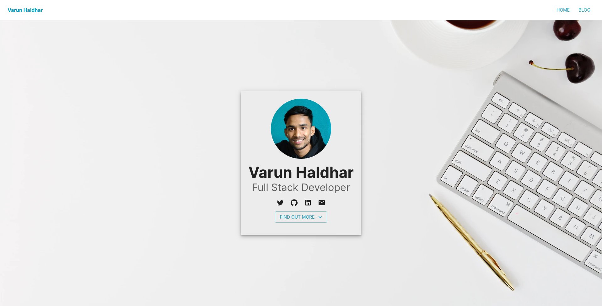

# varunhaldhar-blog

[](https://app.netlify.com/sites/varun-hldr/deploys) &nbsp;

Personal website and blog, built with [Gatsby][gatsby] and [Netlify CMS][netlifycms].  
Live site is **[here](https://imvarun.dev/)**.

[](https://imvarun.dev/)

## 💻 Stack

- Framework: [Gatsby](https://www.gatsbyjs.com/)
- CMS: [Netlify CMS](https://www.netlifycms.org/)
- Deployment: [Netlify](https://www.netlify.com/)
- UI components: [Material-UI](https://material-ui.com/)
- Icons: [Material-UI Icons](https://material-ui.com/components/material-icons/)
- Styling: [Emotion](https://emotion.sh/docs/introduction)
- Linting: [ESLint](https://eslint.org/)
- Code Formatting: [Prettier](https://prettier.io/)

## 👌 Features

- Personal website & blog
- Responsive design
- Customize content pages
- Add/modify/delete blog posts
- SEO optimization
- Open Graph & Twitter meta tags
- XML Sitemaps

## Development

Navigate into your new site’s directory and start it up.

```shell
npm start
```

Your site is now running on `http://localhost:8000`!

Note: You'll also see a second link: `http://localhost:8000/___graphql`. This is a tool you can use to experiment with querying your data. Learn more about using this tool in the [Gatsby tutorial](https://www.gatsbyjs.org/tutorial/part-five/#introducing-graphiql).

You can use Netlify CMS in you local just run `npx netlify-cms-proxy-server` and start run `gatsby develop`

[gatsby]: https://gatsbyjs.org
[netlifycms]: https://www.netlifycms.org
